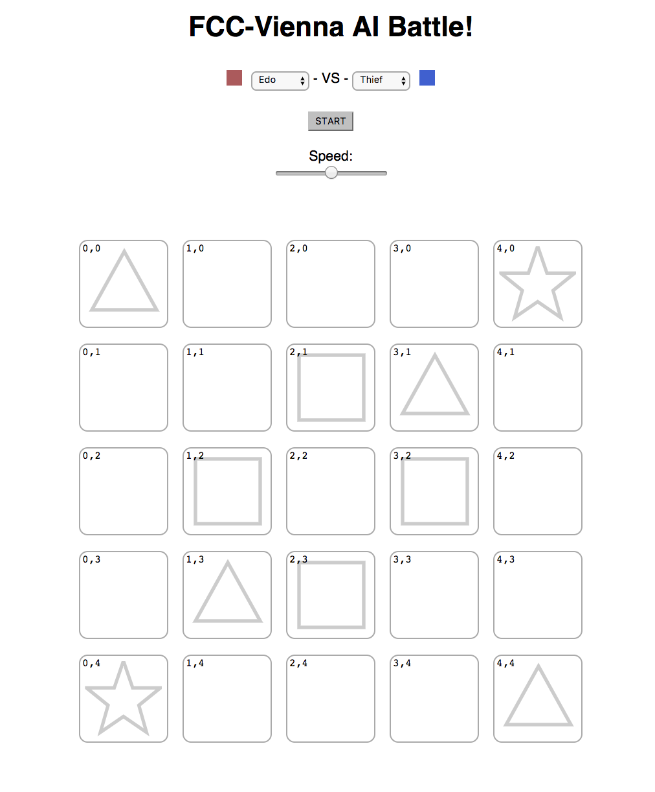
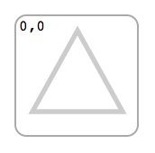
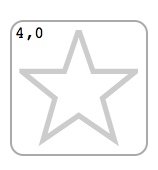
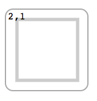
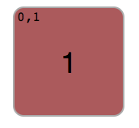
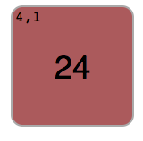

# AI Battle

The purpose of this project is to practice coding, while having fun at the same time!


* [Used technologies](#used-technologies)
* [Setup](#setup)
* [Rules and objective](#rules-and-objective)
	* [Explanations](#explanations)
* [Writing an AI](#writing-an-ai)
	* [Setting up](#setting-up)
	* [The AI skeleton](#the-ai-skeleton)
		* [Name and color boilerplate](#name-and-color-boilerplate)
		* [The `play()` method](#the-play-method)
	* [Game's data structures](#games-data-structures)
		* [Board](#board)
		* [Tile](#tile)
* [Utility functions](#utility-functions)
* [FAQ & troubleshooting](#faq-troubleshooting)
	* [But I can cheat!?!?](#but-i-can-cheat)
	* [The game crashed](#the-game-crashed)
	* [I think the rules/mechanics are bad/weird/suboptimal](#i-think-the-rulesmechanics-are-badweirdsuboptimal)
	* [The human interface sucks](#the-human-interface-sucks)
* [Contributing](#contributing)


### Used technologies

...that you'll touch:
- javascript (this will be ~95% of what you'll touch)
- node
- npm

...that power the game
- redux
- react
- create-react-app
	- webpack
	- babel

## Setup

1. Fork repo
2. Make sure you've installed node 6+
3. Install dependencies: `npm install`
4. Run: `npm start`
5. Open browser at `http://localhost:3000` (should happen automatically at step 4)

Optional:

When you want to get your AI merged, just send out a [pull request](https://help.github.com/articles/about-pull-requests/) and I'll merge it. This way we'll be able to battle each other's AI's!

## Rules and objective

The game is a turn based game, a bit like the board game [Risk](https://en.wikipedia.org/wiki/Risk_(game)). You can spawn units, move them around, and fight your opponent's units. Your objective is to capture all of the strategic _capture points_, or to completely eliminate your opponent.

Or more formally. You win as soon as you fulfill one of these conditions:
- Capture all (4) capture points (the squares)
- Eliminate all enemy units

### Explanations

| Empty | Player 2 won          |
|---------------------------|----------------------------------|
 |  |

In this Example the red player won by capturing the obejctives.

| Key | Functionality          |
|---------------------------|----------------------------------|
|  | The triangle stands for a minor spawn point (spawns 1 unit at a time). From there you can create new units. |
|   | The star stands for a major spawn point (spawns 2 units at a time). From there you can create new units. | 
 | The square stands for an objective to cover. |
 | This army has 1 unit. | 
 | This army has 24 units. |


## Writing an AI

I'll walk you through the process of writing an AI for the game. This section covers the following steps:

1. Setting up
2. The AI skeleton
3. Game's data structures

### Setting up

1. Create a javascript file in `/src/players`, this is where you name your AI. Let's say we name our AI the Vienna AI. In that case, create the file `/src/players/viennaPlayer.js`.
2. Shamelessly copy/paste the contents of the [Passive AI](/src/players/passivePlayer.js) into your newly created file. It should look like this:

```js
export default class PassivePlayer {
	static getName() { return 'Passive' };
	
	constructor(color) {
		this.name = PassivePlayer.getName();
		this.color = color;
	}
	
	play() {
		return [];
	}
}
```

Don't worry, we'll explain what all this does later.

3. Now rename the obvious references to the Passive AI;

```js
export default class ViennaPlayer {
	static getName() { return 'Vienna' };
	
	constructor(color) {
		this.name = ViennaPlayer.getName();
		this.color = color;
	}
	
	play() {
		return [];
	}
}
```

4. Add your player to the game. Open `/src/players/players.js`, and... well, I'll let you figure this step out by yourself.
5. If you've managed to properly add your AI to the game, it should now show up in the dropdowns in the game. Check it out by running `npm start`.

### The AI skeleton

Those know a bit of modern javascript might already have recognized that a player is defined as a class. Every AI class should
have the same API. Now the skeleton breaks up into two pieces:

1. Boilerplate for the name and color
2. The `play()` method

#### Name and color boilerplate
The following part of your AI basically defines your AI's name, and it stores the color it will be given when the game starts.

Don't think too much about it, this is just needed to make the game run.

```js
	static getName() { return 'Vienna' };
	
	constructor(color) {
		this.name = ViennaPlayer.getName();
		this.color = color;
	}
```

#### The `play()` method

Now this is the core of your AI. The game will call the `play()` method on your AI when it's your turn to make a move. It is now up to you to respond to the game with a list of moves that you'll make this turn. To know what move you make, you'll need to know the current state of the board. The game passes this as a function parameter, so your play method actually looks like this:

```js
play(board) {
	// ...insert your fancy AI code here
	return [
		{ unitCount: 2, from : { x: 4, y: 4 }, to: { x: 4, y: 3 } }, // Move 1
		{ unitCount: 6, from : { x: 2, y: 4 }, to: { x: 3, y: 4 } }, // Move 2
	];
}
```

In an imaginary human setting it would kinda look like this:

- Game: _"Hey ViennaPlayer, it's your turn."_
- Game: \*Takes picture of board and passes it to ViennaPlayer\*
- ViennaPlayer: \*Looks at picture, thinks for a while\*
- ViennaPlayer: _"Okay, I move 2 units from (4, 4) to (4, 3), and 6 units from (2, 4) to (3, 4)"_
- Game: \*Moves the units on the board, like ViennaPlayer requested\*
- Game: _"Hey OpponentPlayer, it's your turn."_
- Game: \*Takes picture of board and passes it to OpponentPlayer\*
- OpponentPlayer: \*Looks at picture, thinks for a while\*
- OpponentPlayer: _"Okay, I move 3 units from (0, 0) to (1, 0), and 1 unit from (3, 0) to (4, 0)"_
- Game: \*Moves the units on the board, like OpponentPlayer requested\*
- ...repeat

The picture that _Game_ passes in this setting is the `board` parameter that your AI receives. It's a snapshot of the state of the board at the time that your AI should make it's move. The moves that _ViennaPlayer_ requests are the `array` of moves that you return at the end of your `play` method.

### Game's data structures

Formally:

```js
type Board = {
	tiles: Array<Array<Tile>>,
	players: [Player, Player],
	winner: boolean,
}

type Tile = {
	x: number,
	y: number,
	type: TileType,
	player: Player,
	unitCount: number,
}

type Move = {
	unitCount: number,
	from: {
		x: number,
		y: number,
	},
	to: {
		x: number,
		y: number,
	},
}

type Player = {
	// You shouldn't use player internals. Just check on `tile.player === this`
}

type TileType = 'NEUTRAL' | 'MINOR_SPAWN' | 'MAJOR_SPAWN' | 'CAPTURE_POINT'
// Access tile types like this:
import { tileTypes } from '../constants';
tileTypes.NEUTRAL // 'NEUTRAL'

// And the proper signature of your AI's play method:
play(board: Board): Array<Move>

```

#### Board 

The top level object that you'll receive in your AI. This object contains all of the information that you'll need to decide which moves to make.

#### Tile

The board is divided into _tiles_. Every tile has a type, and can be occupied by a player's units, or not be occupied at all. The tiles are laid out over two dimensions; `x` and `y`. The dimensions are represented as a two-dimensional array. If this makes your head spin, don't worry too much about. All you need to know is how to retrieve a specific tile.

Let's say you want to retrieve the tile at position (x: 3, y: 1), or (3, 1) for short, this is what you'll need:

```js
const someTile = board.tiles[3][1];

// Now you can inspect the tile
const tileIsOccupiedByMe = someTile.player === this;

// And decide what you want to do with it
if (tileIsOccupiedByMe === false) {
	const doIWantToAttackTheTile = someTile.unitCount < 10;
}
```

## Utility functions

TODO

## FAQ & troubleshooting

### But I can cheat!?!?

Yes. Yes you can cheat. You could mutate the board state to trick the game into thinking you won. Actually, that's probably a nice way to learn something. The purpose of this game is to teach people coding, not to be a competitive gaming environment. If you wish to contribute to make the engine more robust; PR's are welcome.

### The game crashed

The game will try to catch illegal moves as best it can, but it could happen that it crashes in some edge case. Please file an issue if you think the game crashed when it shouldn't have.

### I think the rules/mechanics are bad/weird/suboptimal

This game was created over a weekend, and we aim to balance and improve it over time. Suggestions to rules and mechanics are welcome. Please file an issue.

### The human interface sucks

We know. PR please :)

## Contributing

As you might have read in the FAQ & troubleshooting section, we're open to suggestions and contributions. This game is all about teaching people to code. Contributing to the core game would be an awesome way to learn something.

Don't worry, we created this game for fun. We won't bite, and won't scrutinize you if the PR you submit doesn't live up to "elite coding standards".

We encourage people to brainstorm and collaborate on the game.
